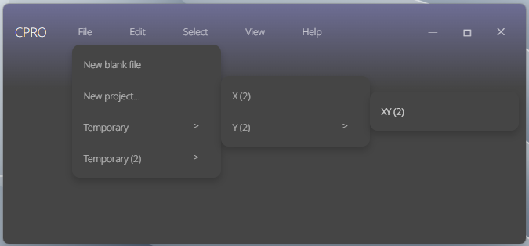

  

Hydroper© Scripting will be a coding environment featuring new user interface skins. It should function near to Visual Studio Code, but more simplistic.

It is not by any means near done nor usable in any way as is.

## Tasks

On-going:

* [ ] User interface: `ContextMenu`
  * **Bug**: Actions only work when clicked with Enter
  * **Bug**: Actions do not work when clicking with the device pointer
  * **Bug**: Click on a list item closes the context menu modal

Not on-going yet:

* [ ] Workspaces
* [ ] Version control
* [ ] Tabs
  * [ ] Continuously recover unsaved tabs
  * [ ] Code area
* [ ] Settings
* [ ] Extensions
* [ ] Cloud synchronization

Special cases:

* [ ] When two tabs have are files with the same filename, automatically split the editor for the respective directories.

## Building

Hydroper© Scripting is developed with [Electron Forge](https://electronforge.io).

## License

Apache 2.0, copyright © Hydroper 2024